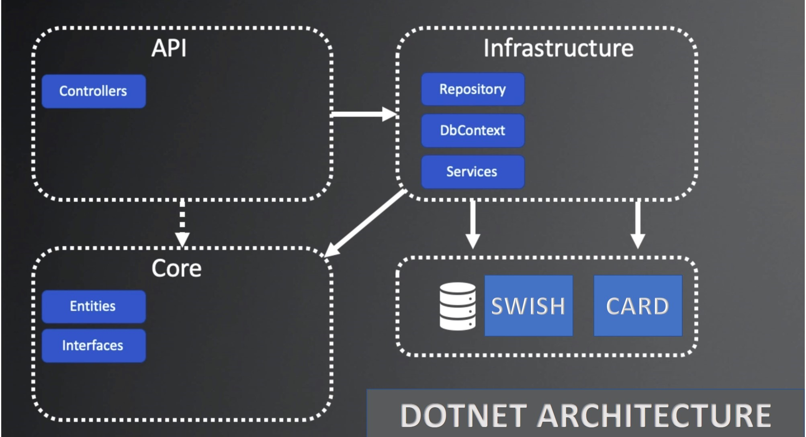

# Bygg

Bygg

## Installation

### Explanation of the commands

### Dotnet Commands

new - Create a new project, configuration file, or solution based on the specified template.
dotnet new webapi -n API -o API
dotnet new classlib -n Core -o Core
dotnet new classlib -n Infrastructure -o Infrastructure
dotnet new sln -n Bygg
add - Add a reference to the project file.
dotnet sln add API
dotnet sln add Core
dotnet sln add Infrastructure
dotnet add API reference Core
dotnet add Infrastructure reference Core
dotnet add Infrastructure package Microsoft.EntityFrameworkCore.SqlServer

### NuGet Commands

dotnet add Infrastructure package Microsoft.EntityFrameworkCore.Design
dotnet add Infrastructure package Microsoft.EntityFrameworkCore.Tools
dotnet add Infrastructure package Microsoft.EntityFrameworkCore.SqlServer

### EF Core Commands

-p Which project to use
-s Which startup project to use
-o Output directory for the migration

To drop DB: dotnet ef database drop -p Infrastructure -s API
To remove Migrations: dotnet ef migrations remove -p Infrastructure -s API
To add Migrations: dotnet ef migrations add InitialCreate -p Infrastructure -s API -o Data/Migrations
To update Database: dotnet ef database update -p Infrastructure -s API

### Explanation of the project

API description for Bygg project Bygg

### Mapp Structure

| Bygg.sln
Program.cs is the entry point for the application
| |-- API\
| | |-- API.csproj
| | |-- API.csproj has a reference to Infrastructure.csproj
Class Library
Entities and Interfaces for the application
| |-- Core\
| | |-- Core.csproj
| | |-- Core.csproj has no references
Class Library
Data Base with logic repository and Unit of Work
| |-- Infrastructure\
| | |-- Infrastructure.csproj
| | |-- Infrastructure.csproj has a reference to Core.csproj

## API

API is the main project that will be used to interact with the application. It will be the entry point for the user to interact with the application.

## Core

Core is the project that will contain all the business logic for the application. It will be the main project that will be used to interact with the database.

## Infrastructure

Infrastructure is the project that will contain all the database logic for the application. It will be the main project that will be used to interact with the database.

##### Product Configuration

public class ProductConfiguration made to configure the Product entity.
It has a method called Configure that takes in an EntityTypeBuilder<Product> parameter.
It then uses the parameter to configure the Product entity.
builder.Property(p => p.Id).IsRequired(); and other properties are configured in the same way.

##### Product

public class Product is the entity that will be used to interact with the database.

##### DataContext

public class DataContext is the class that will be used to interact with the database.

##### IProductRepository

public interface IProductRepository is the interface that will be used to interact with the Product entity.
